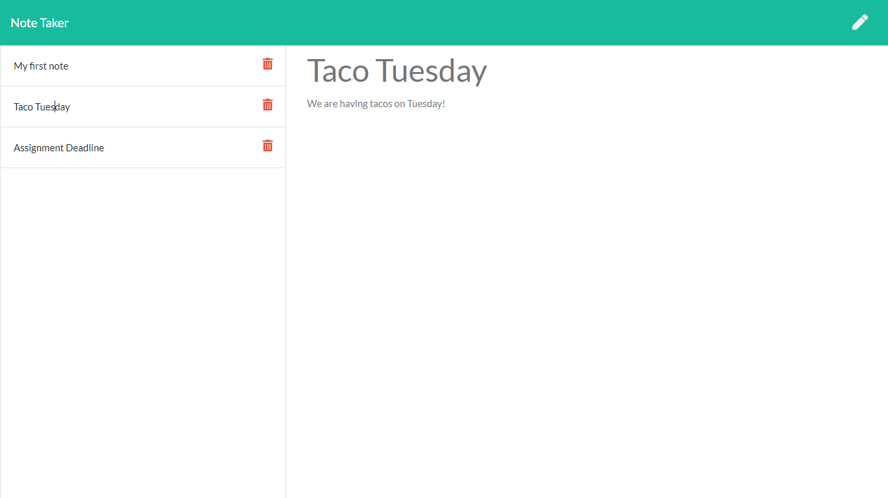

# Note Taker


## Table of Contents

1. [Description](#Description)
2. [Languages and Technologies Used](#Languages-and-Technologies-Used)
3. [Installation](#Installation)
4. [Usage](#Usage)
5. [Screencaps](#Screencaps)
6. [Deployment](#Deployment)
7. [Questions](#Questions)
<br/>
<br/>

## Description

The Note Taker app allows a user to write notes via the front end client to keep track of tasks or other important things that he/she needs to remember. The user can save the note into a persistent data file stored on the back end server by clicking the save icon on the top right of the interface.  In addition, the user can view any saved note by clicking on them in the note list.  If he/she wishes, the user can delete any note as he/she completes the task or if the information is no longer relevant by clicking the delete icon next to the note.  The user can create another new note by clicking the edit icon on the top right of the interface.
<br/>
<br/>

## Languages and Technologies Used

* HTML
* CSS
* JavaScript
* jQuery
* Node.js
* Express
* Heroku

The front end client interface was built with HTML and CSS.  It also uses JavaScript and jQuery to allow the user to communicate with the back end server using the jQuery GET, POST, and DELETE methods.

The back end server is built in Node.js and uses Express to set the routes for GET, POST, and DELETE requests.  The server reads saved notes from a .json file and sends the information back to the client.  When a new note is created using the POST method or one is deleted using the DELETE method, the .json file is updated with the current set of notes.

The app is deployed using Heroku.  [See it here!](https://sheltered-cliffs-84829.herokuapp.com/)
<br/>
<br/>

## Installation

1. Clone the [repository](https://github.com/BrienBarr/Note-Taker) to your PC.
2. Open the local directory to where you cloned the repository in the command line/terminal.
3. Run the npm i command from the command line/terminal.
```
npm i
```
<br/>
<br/>

## Usage

Use the "node server.js" command from the command-line/terminal to start the server connection.
```
node server.js
```
Once the server is running on your PC, you can go to [http://localhost:8080/](http://localhost:8080/) to run the client side interface.

Once you are finished, press CTRL + C in the command-line/terminal to close the server connection.
<br/>
<br/>

## Screencaps

<br/>
Client side landing page<br/>


<br/>
Notes page<br/>


<br/>
Writing a new note<br/>


<br/>
Viewing a saved note<br/>



<br/>
Note deleted<br/>


<br/>
<br/>

## Deployment

The Note Taker app is deployed on Heroku. [See it here!](https://sheltered-cliffs-84829.herokuapp.com/)

## Questions

[GitHub/BrienBarr](https://github.com/BrienBarr)<br/>
For additional questions, e-mail me at: [barrdom@hotmail.com](mailto:barrdom@hotmail.com)
